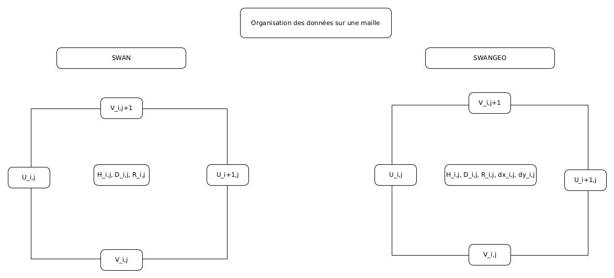
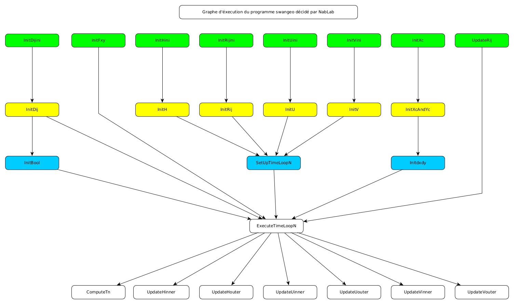
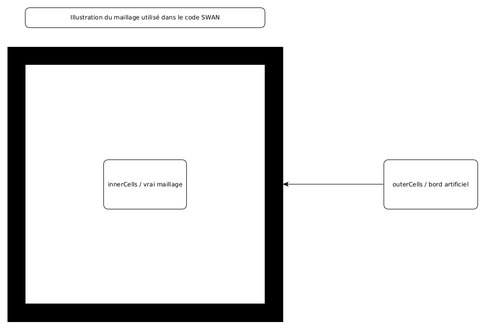
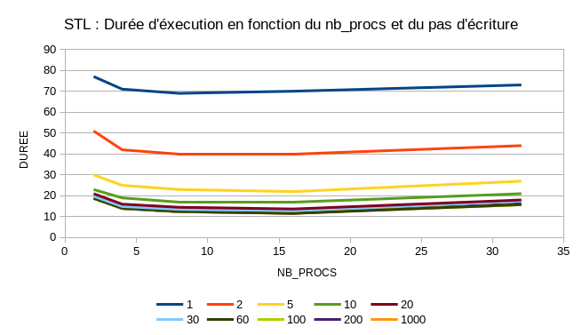

<html>
<title>The SWAN Code</title>
<head>
<meta http-equiv="Content-Type" content="text/html; charset=utf-8" />

</head>

<body>

<!-- ------------------- main content ---------------------- -->
<!----https://hplgit.github.io/teamods/writing_reports/_static/report_blueish.html -->

<h1>The SWAN Code</h1>
  <!-- document title -->

<!-- author: Guillaume LESCROART -->

<b>Guillaume LESCROART { guillaume.lescroart.ocre@cea.fr }</b>

<!-- institution -->

<b>CEA</b>

 

<b>Ce document a été écrit pour permettre une bonne compréhension du code SWAN développé en langage Nabla. Il permettra également de faciliter l'utilisation et la modification de celui-ci. En bref, ceci est une doc du code SWAN.</b> 
<h1 id="table_des_matières">
Table des matières</h2>

<a href="#___LE_PROBLEME_PHYSIQUE"> Le problème physique </a> 
<a href="#___LE_SCHEMA_NUMERIQUE"> Le schéma numérique </a> 
<a href="#___LE_GRAPHE_DU_PROGRAMME"> Le graphe du programme </a> 
<a href="#___LES_FONCTIONS_DE_LECTURE_DE_FICHIERS"> Les fonctions de lecture de fichiers </a> 
<a href="#___LES_SINGLETONS"> Les singletons </a> 
<a href="#___L_INITIALISATION_DES_VARIABLES"> L'initialisation des variables </a> 
<a href="#___UTILISATION_DU_PROGRAMME"> Utilisation du programme </a> 
<a href="#___LES_PROBLEMES_D_AFFICHAGE"> Les problèmes d'affichage </a> 
<a href="#___L_ARBORESCENCE_DU_PROJET"> L'arborescence du projet </a> 
<a href="#___LA_GENERATION_DE_CODE"> La génération de code  </a> 
<a href="#___PERFORMANCES_ET_RESULTATS"> Performances et résultats </a> 

<h1 id="___LE_PROBLEME_PHYSIQUE">Le problème physique </h1>

Le code SWAN est un code de simulation de propagation d'ondes, basé sur des équations <a href="https://en.wikipedia.org/wiki/Shallow_water_equations" target="_self">SHALLOW WATER</a>. 
Le modèle utilisé est tiré du chapitre 2 du livre intitulé <a href="https://books.google.fr/books?id=1UGcWQFn0lsC&printsec=frontcover&hl=fr#v=onepage&q&f=false" target="_self">NUMERICAL MODELING OF WATER WAVES</a> de Charles L. Mader. 
Le lecteur intéressé pourra lire ce chapitre afin de comprendre le raisonnement menant au système d'équations aux dérivées partielles suivant :  
\begin{align}
\frac{\partial U_x}{\partial t} + U_x \frac{\partial U_x}{\partial x} + U_y \frac{\partial U_x}{\partial y} + g \frac{\partial H}{\partial x} = FU_y + F^{(x)} - g \frac{U_x(U^2_x + U^2_y)^{1/2}}{C^2(D+H-R)} 
\end{align}
\begin{align}
\frac{\partial U_y}{\partial t} + U_x \frac{\partial U_y}{\partial x} + U_y \frac{\partial U_y}{\partial y} + g \frac{\partial H}{\partial y} = -FU_x + F^{(y)} - g \frac{U_y(U^2_x + U^2_y)^{1/2}}{C^2(D+H-R)} 
\end{align}
\begin{align}
\frac{\partial H}{\partial t} + \frac{\partial (D+H-R)U_x}{\partial x} + \frac{\partial (D+H-R)U_y}{\partial y} - \frac{\partial R}{\partial t} = 0
\end{align}

$U_x$ : vitesse dans la direction x (indice i), $U_x$ devient $U$ dans les équations discrétisées 
$U_y$ : vitesse dans la direction y (indice j), $U_y$ devient $V$ dans les équations discrétisées 
$g$   : accélération de la gravité ($-9.8$ $m.s^{-2}$) 
$t$   : temps 
$H$   : hauteur d'eau au dessus de la surface au repos 
$R$   : mouvement du sol 
$F$   : paramètre de Coriolis 
$C$   : coefficient de De Chezy 
$F^{(x)}, F^{(y)}$   : Fonctions de forçage 
$D$   : profondeur 

<h1 id="___LE_SCHEMA_NUMERIQUE"> Le schéma numérique </h1>

Vous trouverez ci-dessous le schéma numérique implémenté, ainsi qu'une illustration d'une maille. Cette dernière montre comment sont organisées les données sur le maillage. 
</img> 

\begin{align}
H^{n+1}_{i,j} = H^n_{i,j} - \Delta t \Biggl[ \frac{U^n_{i+1,j}}{\Delta x}(TD1) - \frac{U^n_{i,j}}{\Delta x}(TD2) +  \frac{V^n_{i,j+1}}{\Delta y}(TV1) -  \frac{V^n_{i,j}}{\Delta y}(TV2)\Biggr] + R^{n+1}_{i,j} - R^{n}_{i,j}
\end{align}

\begin{align}
TD1 &amp = D_{i+1,j} + H^n_{i+1,j} - R^n_{i+1,j} &amp (U^n_{i+1,j} \lt 0) \\
TD1 &amp = D_{i,j}   + H^n_{i,j}   - R^n_{i,j} &amp (U^n_{i+1,j} \gt 0) \\
TD2 &amp = D_{i,j}   + H^n_{i,j}   - R^n_{i,j} &amp (U^n_{i,j} \lt 0) \\
TD2 &amp = D_{i-1,j}   + H^n_{i-1,j}   - R^n_{i-1,j} &amp (U^n_{i,j} \gt 0) \\
TV1 &amp = D_{i,j+1}   + H^n_{i,j+1}   - R^n_{i,j+1} &amp (V^n_{i,j+1} \lt 0) \\
TV1 &amp = D_{i,j}   + H^n_{i,j}   - R^n_{i,j} &amp (V^n_{i,j+1} \gt 0) \\
TV2 &amp = D_{i,j}   + H^n_{i,j}   - R^n_{i,j} &amp (V^n_{i,j} \lt 0) \\
TV2 &amp = D_{i,j-1}   + H^n_{i,j-1}   - R^n_{i,j-1} &amp (V^n_{i,j} \gt 0) \\
\end{align}

\begin{align}
U^{n+1}_{i,j} = U^n_{i,j} - \Delta t \Biggl[\frac{U^n_{i,j}}{\Delta x}(TU1) + \frac{TV}{\Delta y}(TU2)\Biggr] - g \frac{\Delta t}{\Delta x}\Bigl[THU\Bigr] + \Delta t \Bigl[-FV^n_{i,j} - F^{(x)}_{i,j} + S^B_{i,j}\Bigr]
\end{align}

\begin{align}
TV  &amp = 0.25 * (V^n_{i,j} + V^n_{i,j+1} + V^n_{i-1,j+1} + V^n_{i-1,j} )  \\
TU1 &amp = U^n_{i+1,j} - U^n_{i,j} &amp (U^n_{i,j} \lt 0)\\
TU1 &amp = U^n_{i,j}   - U^n_{i-1,j} &amp (U^n_{i,j} \gt 0)\\
TU2 &amp = U^n_{i,j+1} - U^n_{i,j} &amp (TV \lt 0)\\
TU2 &amp = U^n_{i,j}   - U^n_{i,j-1} &amp (TV \gt 0)\\
THU &amp = H^n_{i,j}   - H^n_{i,j-1} &amp \\
S^B_{i,j} &amp = gU^n_{i,j}\frac{\Biggl[(U^n_{i,j})^2 + (V^n_{i,j})^2\Biggr]^{1/2}}{C^2(D_{i,j})+H^n_{i,j}}\\
\end{align}

\begin{align}
V^{n+1}_{i,j} = V^n_{i,j} - \Delta t \Biggl[\frac{TU}{\Delta x}(TV1) + \frac{V^n_{i,j}}{\Delta y}(TV2)\Biggr] - g \frac{\Delta t}{\Delta y}\Bigl[THV\Bigr] + \Delta t \Bigl[-FU^n_{i,j} - F^{(y)}_{i,j} + S^B_{i,j}\Bigr]
\end{align}

\begin{align}
TU  &amp = 0.25 * (U^n_{i,j} + U^n_{i,j+1} + U^n_{i-1,j+1} + U^n_{i-1,j} )  \\
TV1 &amp = V^n_{i+1,j} - V^n_{i,j} &amp (U^n_{i,j} \lt 0)\\
TV1 &amp = V^n_{i,j}   - V^n_{i-1,j} &amp (U^n_{i,j} \gt 0)\\
TV2 &amp = V^n_{i,j+1} - V^n_{i,j} &amp (TV \lt 0)\\
TV2 &amp = V^n_{i,j}   - V^n_{i,j-1} &amp (TV \gt 0)\\
THV &amp = H^n_{i,j}   - H^n_{i,j-1} &amp \\
S^B_{i,j} &amp = gU^n_{i,j}\frac{\Biggl[(U^n_{i,j})^2 + (V^n_{i,j})^2\Biggr]^{1/2}}{C^2(D_{i,j})+H^n_{i,j}}\\
\end{align}

<h1 id="___LE_GRAPHE_DU_PROGRAMME"> Le graphe du programme </h1>
</img> 

<h1 id="___LES_FONCTION_DE_LECTURE_DE_FICHIERS"> Les fonction de lecture de fichiers </h1>

Comme dans beaucoup de programme, l'initialisation des variables nécessaires à la simulation requiert la lecture de données depuis des fichiers. Dans notre cas, nous sommes amenés à lire des fichiers avec extension .nc ou .grd, qui sont des fichiers au format netcdf. Il est possible d'inspecter manuellement le contenu d'un fichier en utilisant le programme "ncdump". Il est également possible d'utiliser une librairie afin d'extraire les données. C'est cette dernière possibilité qu'utilise notre code. De plus ample informations peuvent être trouvées sur le site de <a href="https://www.unidata.ucar.edu/software/netcdf/docs/index.html" target="_self">l'organisation</a> gérant la libnetcdf.  Ci-dessous une image montrant l'organisation des données au sein d'un fichier .grd. 
</img> 
Les fonctions de lecture de fichiers .grd sont ce que nous appelons des fonctions externes. Celles-ci s'exécutent obligatoirement de manière séquentielle. Dans le cas du code SWAN, les seules fonctions externes utilisées sont des fonctions de lecture de fichier. Nous allons détaillez un peu. Les fichiers .grd sont utilisés pour initialiser les variables vivant sur les cells ( H, D, R, latitude, longitude). Lorsque l'utilisateur écrit quelque chose comme $\forall ic \in innerCells()$ dans un fichier source .nabla, cela sera traduit en une boucle sur toutes les innerCells. L'ordre de parcours des cells se fait ligne par ligne, du bas vers le haut. Les valeurs des grandeurs d'intérêt stockées dans les fichiers sont ordonnées de la même façon. Les fonctions de lecture ne font donc que récupérer les données dans un tableau, puis renvoient les valeurs une par une. À chaque appel, un compteur, qui est l'indice de la prochaine valeur à renvoyer, est incrémenté. Dans le cas des longitudes et latitudes, leur fonction externe respective, doit procéder à une étape supplémentaire entre la lecture et la création du tableau de données. Cette dernière information n'intéressera que les personnes voulant comprendre le code des fonctions externes ou voulant modifier ces dernières. 
Un utilisateur doit seulement retenir que les variables stockées sur chaque cell, se remplissent ligne par ligne, du bas vers le haut. 
Il doit également se souvenir que le maillage utilisé contient un "bord artificiel" servant à imposer des conditions au bord. Les fichiers .grd contiennent uniquement les valeurs des innerCells ! Nous verrons par la suite que la taille du maillage est donnée au programme par un fichier .json. Cette taille prend en compte le bord artificiel. 
Ci-dessous une illustration expliquant comment la libnetcdf est utilisée dans le code des fonctions externes. 
</img>

<h1 id="___LES_SINGLETONS"> Les singletons </h1>
Vous remarquez que le code comporte beaucoup de $\forall qqchose \in unensemble$. Ces expressions sont en principe transcrite comme des boucles sur chacun des éléments de "unensemble". Dans notre cas, il faut voir ça uniquement comme un point de syntaxe à connaitre. En effet, dans le code SWAN, les ensembles sont souvent des singletons. Nous pouvons donc voir ces expressions comme des "définitions", $\forall rc \in rightCell(c)$ peut être lu ici, et à priori seulement ici, dans le code SWAN, "soit rc la cellule à droite de c". Cette information va sans doute faciliter la lecture et la compréhension du code. 

<h1 id="___L_INITIALISATION_DES_VARIABLES"> L'initialisation des variables </h1>
Lors de la lecture du code, vous avez remarqué (ou vous remarquerez) que l'initialisation se fait à l'aide d'une "astuce". En effet, souvenons nous que nous avons autour du vrai maillage, un "bord artificiel". Celui-ci est constitué de cells (et de faces ) que l'on doit mettre à jour à chaque pas de temps. Jusqu'ici rien d'anormal. Si ce n'est que chaque cell et face du bord du maillage, va être initialisé en allant chercher les valeurs de son plus proche voisin contenu dans le vrai maillage. Il n'est pas possible d'imposer d'ordonnancement(initialiser d'abord l'intérieur, puis les bords) au temps t=0 avec le langage nabla. Nous devons donc utiliser deux variables, H et Hini afin d'initialiser, au temps $t_0$, la variable H. Nous remplissons d'abord l'intérieur du maillage à l'aide de Hini, puis nous clonons les valeurs sur le bord, avant de recopier dans H, les valeurs de Hini. Si nous ne faisons pas cela, NabLab va détecter un cycle, et refusera de générer du code. 
</img>

<h1 id="___UTILISATION_DU_PROGRAMME"> Utilisation du programme </h1>
L'utilisation des programmes swan et swangeo est grandement simplifiée grâce aux capacités de NabLab. Après compilation des sources, le programme s'exécute comme suit :  
./swan path/to/options.json 
L'intégralité des informations à fournir au programme doit être écrite dans ce fichier d'options. Nous allons détailler son contenu et expliquer brièvement le rôle de chacun des champs du fichier json. 
</img> 

<h1 id="___LES_PROBLEMES_D_AFFICHAGE"> Les problèmes d'affichage </h1>
Des problèmes d'affichage peuvent survenir. Généralement, cela signifie que les valeurs contenues dans les fichiers de résultats sont égales à Inf, nan, -nan, etc.
Lorsque cela se produit, paraview peut soit afficher du jaune, soit ne plus rien afficher du tout, soit indiquer un message d'erreur comme "can't read value at ...". Cela se produit notamment si le pas de temps et le pas d'espace ne vérifient pas la condition CFL. Il vous faudra alors soit réduire le pas de temps de la simulation, soit augmenter les pas d'espaces. 
Nous tenons à faire remarquer que dans le cas du code SWAN, la condition CFL nous indique que le pas de temps doit vérifier : $ \delta t \lt \frac{0.3}{200} \delta x $. Pour un pas $\delta x = 3000$ mètres, $\delta t = 5s$ devrait être suffisant. Nous avons remarqué que la simulation explose si $\delta t \gt 0.1 s$. Ce comportement reste à ce jour inexpliqué.

<h1 id="___L_ARBORESCENCE_DU_PROJET"> L'arborescence du projet </h1>
Nous allons dans cette partie discuter de l'organisation du projet en différents répertoires. Nous détaillerons le contenu de chacun de ceux-ci. 
NOTE: Nous verrons des dossiers appelés swan/ et swangeo/. Ce qui signifie que le code SWAN est disponible en deux versions légèrement différentes: 
"swan" prend en paramètre des fichiers .grd en coordonnées CARTESIENNES. 
"swangeo" prend en paramètre des fichiers .grd en coordonnées GEOGRAPHIQUES. 
Les fichiers sources en langage nabla sont quasiment identique, le schéma numérique est lui exactement identique. La différence est que les pas d'espaces sont les mêmes pour toutes les cellules du maillage dans "swan", et dépendent du couple (latitude / longitude) dans "swangeo". 
<ul>
  <li>
    <ul>META-INF/</ul> Ce dossier contient un fichier d'information à destination de l'éditeur NabLab.
  </li>
  <li>
    <ul>data/</ul> 
    <ul>
      <li>swan/    : Ce dossier contient des bathymétries et des surfaces d'eau en coordonnées CARTESIENNES,  au format .grd (.nc), à n'utiliser qu'avec le programme "swan".</li>
      <li>swangeo/ : Ce dossier contient des bathymétries et des surfaces d'eau en coordonnées GEOGRAPHIQUES, au format .grd (.nc), à n'utiliser qu'avec le programme "swangeo".</li>
    </ul>
  </li>
  <li>
    <ul>src-gen-cpp/stl-thread/</ul>
    <ul>
      <li>swan/    : Ce dossier contient tous les fichiers nécessaire à la construction du programme "swan". Il contient également les fichiers .h et .cpp des fonctions externes précedemment discutées, nécessaires pour l'étape de compilation.</li>
      <li>swangeo/ : Ce dossier contient tous les fichiers nécessaire à la construction du programme "swangeo". Il contient également les fichiers .h et .cpp des fonctions externes précedemment discutées, nécessaire pour l'étape de compilation.</li>
    </ul>
  </li>
  <li>
    <ul>src-gen/</ul>
    <ul>
      <li>swan/    : Ce dossier contient le fichier Swan.tex, une représentation du fichier source Swan.nabla sous forme de fichier LATEX.</li>
      <li>swangeo/ : Ce dossier contient le fichier Swan.tex, une représentation du fichier source SwanGEO.nabla sous forme de fichier LATEX.</li>
    </ul>
  </li>
  <li>
    <ul>src/</ul>
    <ul>
      <li>swan/    : Ce dossier contient les fichiers Swan.nabla et le fichier de configuration de la génération de code Swan.nablagen.</li>
      <li>swangeo/ : Ce dossier contient les fichiers SwanGEO.nabla et le fichier de configuration de la génération de code SwanGEO.nablagen.</li>
    </ul>
  </li>
  <li>
    <ul>usecases/</ul>
    <ul>
      <li>swan/    : Ce dossier contient des fichiers .json utilisables tels quels, destinés à être personnalisés par l'utilisateur. Nous rappelons que ces fichiers sont à donner en argument du programme "swan" uniquement. Le sous dossier squareGaussCases/, contient un ensemble de fichiers d'options json, ainsi qu'une vidéo par fichier json, montrant le résultat que l'on obtient après simulation, en utilisant le fichier json en question. Le contenu de ce sous dossier n'est pas destiné à être modifié par l'utilisateur.
      <li>swangeo/    : Ce dossier contient des fichiers .json utilisables tels quels, destinés à être personnalisés par l'utilisateur. Nous rappelons que ces fichiers sont à donner en argument du programme "swangeo" uniquement. Le sous dossier mediterrCases/, contient un ensemble de fichiers d'options json, ainsi qu'une vidéo par fichier json, montrant le résultat que l'on obtient après simulation, en utilisant le fichier json en question. Ces cas tests concernent le tsunami provoqué par le séisme de Boumerdes, 2003. Le contenu de ce sous dossier n'est pas destiné à être modifié par l'utilisateur. 
    </ul>
  </li>
</ul>

<h1 id="___LA_GENERATION_DE_CODE"> La génération de code </h1>
L'environnement de développement NabLab, outre le fait de permettre l'édition d'un code source, permet de générer un code en langage généraliste, compilable ou interprétable. NabLab peut générer du code source en C++ (compilable) et en java (interprétable). Cet IDE nous permet de faire mieux qu'une simple génération de code. En effet, nous choisissons l'outil qui sera utilisé pour paralléliser le code, parallélisation qui est faites en mémoire partagé (multithread). Il est cependant possible de demander une génération de code séquentiel. Nous choisissons le type de code généré dans le fichier possédant une extension .nablagen, situé dans le même dossier que le fichier .nabla .  
Ainsi, il est possible de générer: 
<ul>
<li> Java Séquentiel</li>
<li> Java Multithread</li>
<li> C++ Séquentiel</li>
<li> C++ Multithread STL</li>
<li> C++ Multithread OpenMP</li>
<li> C++ Multithread Kokkos</li>
<li> C++ Multithread KokkosTeamThread</li>
</ul>
Dans ce projet gitlab, nous avons choisi d'utiliser du code C++ Multithread STL, pour des raisons de portabilités. En effet, c'est le seul backend ne nécessitant pas d'installer de librairie externe. Nous verrons dans la partie suivante, que nous avons tout de même utilisé du C++ Multithread Kokkos pour faire des tests de scalabilités. 

<h1 id="___PERFORMANCES_ET_RESULTATS"> Performances et résultats </h1>
Dans cette section, nous discuterons des résultats obtenus, que ce soit des performances en elles-même, ou que ce soit de la cohérence de la simulation avec les prédictions faites en 2003 par le CEA.
Nous commencerons par analyser les résultats de la simulation, puis nous finirons par les mesures de performances qui ont été effectuées. 

Vous trouverez ci-dessous les résultats de la propagation du tsunami de Boumerdes calculés par le programme "swangeo" et calculés par le CEA en 2003 (ces dernières données sont les durées minimales théoriques d'arrivées). 
Nous pouvons remarquer que la valeur calculé par "swangeo" au niveau de la ville de Leucate (ville représentée la plus à gauche) est incohérente avec les données du CEA. Nous n'avons pas d'explication pour cela. Conernant la ville de Fos-sur-mer, nous avons calculé un temps d'arrivé de 95 minutes, contre 120 fournis par le CEA. Bien que celà soit cohérent ( 95 < 120 ), la différence reste assez importante. Pour toutes les autres villes, les temps d'arrivées calculés sont cohérents avec ceux du CEA. De plus, la forme de la première vague correspond bien à celle fournit par le CEA. 

TEMPS D'ARRIVEE DU TSUNAMI CALCULE AVEC SWANGEO  
</img> 
TEMPS D'ARRIVEE DU TSUNAMI CALCULE PAR LE CEA  
</img> 
 
Nous allons maintenant nous intéresser aux mesures de performances qui ont été effectués. Nous n'avons traité que les codes générés avec les backends C++ Multithread STL et C++ Multithread Kokkos. Nous avons étudier les propriétés de scalabilités forte. Les mesures ont été faites sur le programme "swan" avec un cas test "canal" disponible sur le gitlab, dans les usecases. La version testée était encore en développement aux moments des mesures, mais les algorithmes effectuant la quasi totalité des calculs étaient déjà implémentés. Nous allons maintenant expliquer nos mesures :  
<ul>
  <li>Scalabilité forte : Pour étudier la scalabilité forte, il faut doubler la puissance de calcul (ici on double le nombre de processeur) en concervant la taille du problème constante(ici la taille du maillage). Dans l'idéal, en doublant le nombre de processeur, le temps de calcul devrait être divisé par deux. Ce résultat est théorique, en pratique, le gain de temps est beaucoup moins élevé. Le but est seulement de s'approcher le plus possible d'un facteur deux. Nous avons étudié la scalabilité forte en faisant varier le pas d'écriture. Cela nous a permis de prouver que ce pas était un facteur limitant. Nous avons également étudié la scalabilité forte, en fonction de la taille du maillage pour le backend C++ Multithread STL.</li>
  </img> 
  </img> 
  </img> 
</ul>

Sur les 3 graphes ci-dessus, lorsque la taille du maillage n'est pas précisée, celle-ci est de l'ordre de 50 000 mailles. Nous pensons que c'est ce qui explique le fait que les durées d'exécutions en fonctions du nombres processeurs utilisés sont relativement constant, pour un pas d'écriture donné. La création des threads est coûteuse et masque tout possible gain de performance. 
Sur le premier graphe, le pas d'écriture est pris suffisamment grand pour qu'il n'ait quasiment aucun impact sur le temps de calcul. Ce graphe nous montre bien qu'un gain de performance est présent dès que la taille du maillage augmente. Nous remarquons qu'avec 32 coeurs, les performances se dégradent un peu. Les points correspondant semblent aberrant. Il s'agit sans doute d'un problème provoqué par la machine de test. 

<h3>Propositions pour le futur concernant l étude des performances</h3>
Nous pensons qu'il serait intéressant de tester les performances obtenues avec notre code sur une machine disposant de GPU, en utilisant le backend de parallélisation KokkosTeamThread. 
Nous pensons également que faire des tests de scalabilités faible en faisant varier le pas d'écriture pourrait donner des résultats intéressant. La version C++ Multithread STL, libéré du facteur limitant qu'est le pas d'écriture, n'a pas montré de propriétés de scalabilité forte. Nous nous attendons à ce qu'il en soit de même pour la scalabilité faible.  Cependant, la version C++ Multithread Kokkos a montré une certaine scalabilité forte, quoiqu'imparfaite, laissant penser qu'il y a une certaine scalabilité faible grâce à Kokkos. Nous invitons le lecteur à s'intéresser aux courbes présentes ci-dessus pour en savoir un peu plus. 
